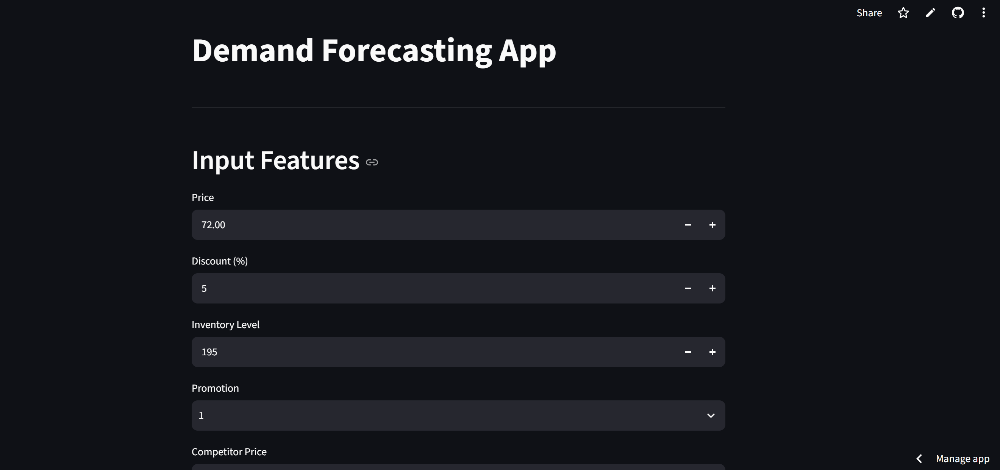
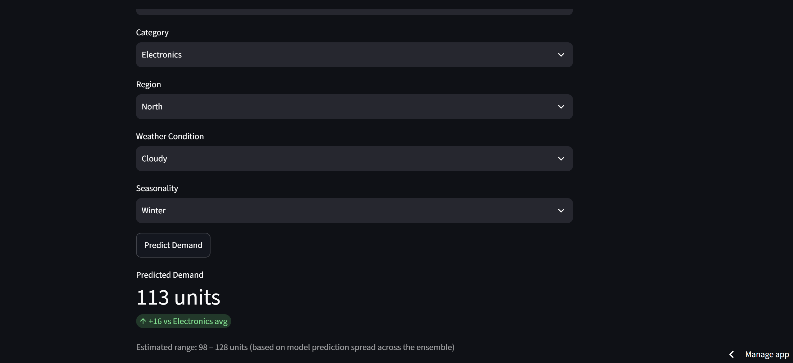

# Demand Forecasting App
Predicting product demand from price, promotions, and market conditions using a Random Forest model — deployed as an interactive Streamlit app.

**🔗 Live app:** [salmalas-demand-forecasting.streamlit.app](https://salmalas-demand-forecasting.streamlit.app/)




 
## Overview
 
This project analyzes what actually drives product demand — price, discounts, promotions, inventory levels, competitor pricing, category, region, weather, and seasonality — and turns the resulting model into a live prediction tool. A Random Forest model beats a category-mean baseline by ~35% (MAE). Digging into *why* the model makes the predictions it does turned up a more interesting story than a simple feature ranking — see [Model Behavior & Limitations](#model-behavior--limitations) below.
 
## Dataset
 
- Source: [GitHub](https://github.com/Onurbltc/DemandForecastingDataset)
- 76,000 rows, spanning January 2022 – January 2024
- Multi-store, multi-product retail data across 5 categories (Electronics, Clothing, Groceries, Furniture, Toys) and 4 regions
- Columns include: `Price`, `Discount`, `Inventory Level`, `Promotion`, `Competitor Pricing`, `Category`, `Region`, `Weather Condition`, `Seasonality`, `Units Sold`, `Units Ordered`, `Epidemic`, `Demand`
## Approach
 
Two modeling directions were explored:
 
1. **Time-series forecasting** — predicting total daily demand from date/lag/rolling features
2. **Feature-based prediction** — predicting demand from price, promotion, and market conditions on a given row
The project settled on the **feature-based approach**, since the dataset's rich contextual columns (price, promotions, competitor pricing, weather, seasonality) carry more signal for this data than pure time trends, and the resulting model answers a more actionable business question: *what drives demand, and what happens if conditions change?*
 
## Results
 
### Baselines
| Model | MAE | RMSE | MAPE |
|---|---|---|---|
| Global mean | 36.78 | 46.73 | 56.17% |
| Category mean | 34.19 | 43.35 | 50.23% |
 
### Random Forest (9 features)
| Model | MAE | RMSE | MAPE |
|---|---|---|---|
| Random Forest | **22.32** | **31.81** | 30.94% |
 
The model reduces error by **~35% (MAE)** and **~27% (RMSE)** over the category-mean baseline.
 
**Note on MAPE:** MAPE remains high (~31%) even though MAE/RMSE improve substantially. This is a known artifact of the metric — a small number of rows with genuinely low demand (minimum = 4 units) produce very large percentage errors even when the absolute error is small. MAE and RMSE are the more representative metrics for this dataset.
 
### Hyperparameter tuning
A randomized search (`RandomizedSearchCV`, 3-fold CV) over `n_estimators`, `max_depth`, `min_samples_split`, `min_samples_leaf`, and `max_features` was run. The tuned model (MAE=23.51) did **not** outperform the default configuration (MAE=22.32), suggesting the defaults were already well-suited to this dataset.
 
## Model Behavior & Limitations
 
### Feature importance: two measures, two different stories
scikit-learn's default importance (Mean Decrease in Impurity) ranked Price 1st:
 
| Feature | MDI Importance |
|---|---|
| Price | 33.0% |
| Category | 14.2% |
| Competitor Pricing | 13.3% |
| Inventory Level | 13.3% |
| Promotion | 8.0% |
| Region | 6.5% |
| Discount | 4.8% |
| Seasonality | 3.8% |
| Weather Condition | 3.2% |
 
But MDI importance is known to be biased toward continuous, high-cardinality features (Price has hundreds of unique values; Category has 5) — it can overstate a feature's real contribution. Re-ranking with **permutation importance** (which measures actual degradation in test-set accuracy when a feature is shuffled, not split-count bias) tells a different story:
 
| Feature | Permutation Importance |
|---|---|
| Category | 40.7 |
| Price | 30.0 |
| Region | 7.9 |
| Promotion | 5.4 |
| Competitor Pricing | 3.0 |
| Discount | 3.0 |
| Inventory Level | 2.3 |
| Weather Condition | 0.9 |
| Seasonality | 0.9 |
 
Category, not Price, is the dominant driver — Price remains a strong second, but the two measures disagree on which one leads.
 
### Does the model capture real price elasticity?
Not in a straightforward sense. Pooled across all categories, Price and Demand have a **negligible correlation (r ≈ 0.002)** — despite Price being the model's 2nd most important feature by permutation importance. This isn't a contradiction: it's **Simpson's paradox**. Computed *within* each category instead of pooled, the correlation is moderate and consistently positive:
 
| Category | Price–Demand correlation (within category) |
|---|---|
| Electronics | 0.371 |
| Furniture | 0.445 |
| Toys | 0.437 |
| Clothing | 0.234 |
| Groceries | 0.217 |
 
Differing price/demand baselines *across* categories were masking a real relationship *within* each one. Notably, the relationship is **positive** — higher-priced items tend to have higher demand within their category — the opposite of typical real-world price elasticity. This likely reflects a "premium item" effect (pricier SKUs within a category may simply be the more popular ones) rather than genuine price sensitivity, and/or is an artifact of how this synthetic dataset (see [Dataset](#dataset)) was generated rather than real consumer behavior.
 
**Takeaway:** the model is a legitimate, well-validated predictor within the patterns this dataset contains — but "Price is important" should not be read as "the model learned realistic price elasticity" without this kind of follow-up. Predictions for inputs far outside the training distribution (e.g. prices beyond ~$230, where the training data thins out to single digits of rows) should be treated with low confidence, since tree-based models cannot extrapolate beyond patterns seen in training.
 
### Prediction confidence
Rather than a single point estimate, the app reports a range alongside each prediction — computed from the spread of predictions across the Random Forest's individual trees — plus a comparison to that category's average demand, so a prediction like "113 units" comes with context (e.g. *"98–128 units, +16 vs. Electronics avg"*) instead of an unqualified number.
 
## Deployment optimization
 
The initial model (300 trees, unbounded depth, trained on the full dataset) serialized to **1.82GB** — far too large to deploy or version in GitHub. To ship a usable model:
 
- Reduced to **100 estimators, max depth 15**
- Compressed the serialized model with `joblib` (`compress=9`)
- Verified the smaller model on the real held-out test set before shipping: **MAE=23.01** vs. the original **MAE=22.32** — a **<3% difference**, confirming the size reduction cost negligible accuracy
This is a deliberate accuracy/deployability tradeoff, verified rather than assumed.
 
## Tech stack
 
- **Analysis:** Python, pandas, NumPy, scikit-learn, matplotlib, seaborn
- **App:** Streamlit
- **Model serialization:** joblib
## Repository structure
 
```
├── Demand_Forecasting.ipynb     # Full analysis: EDA, baselines, modeling, evaluation
├── Demand_Forecasting.py        # Streamlit app
├── demand_forecasting.csv       # Dataset
├── rf_demand_model.pkl          # Trained, compressed Random Forest model
├── model_features.pkl           # Feature column order used by the model
├── label_encoders.pkl           # Fitted LabelEncoders for categorical features
├── category_avg_demand.pkl      # Per-category average demand (for context in predictions)
└── requirements.txt
```
 
## Running locally
 
```bash
git clone https://github.com/salmalas/Demand-Forecasting-Predicting-Product-Demand-from-Price-Promotions-Market-Conditions.git
cd Demand-Forecasting-Predicting-Product-Demand-from-Price-Promotions-Market-Conditions
pip install -r requirements.txt
streamlit run Demand_Forecasting.py
```
 
## Future work
 
- A true multi-step time-series forecast (date-driven, recursive prediction) as a complementary view alongside the current conditions-based model
- A price/promotion "what-if" comparison view, letting users see how demand shifts across a range of prices rather than one prediction at a time
